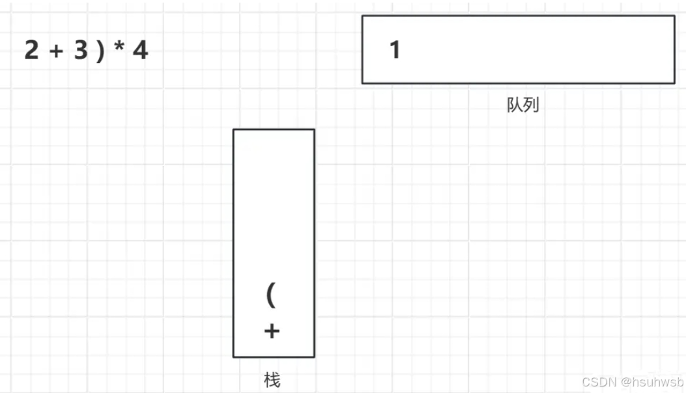
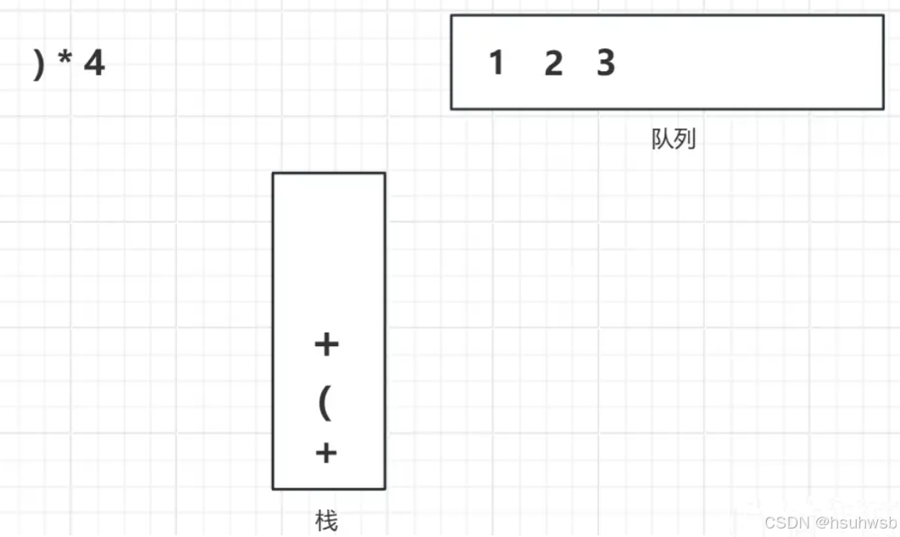
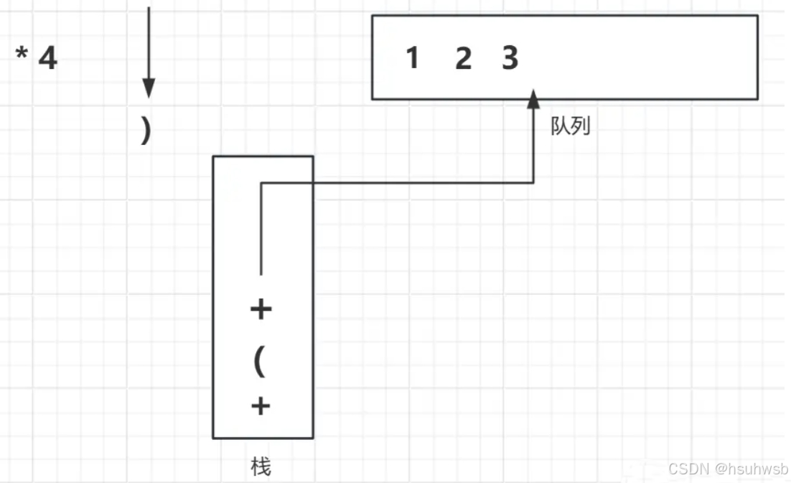
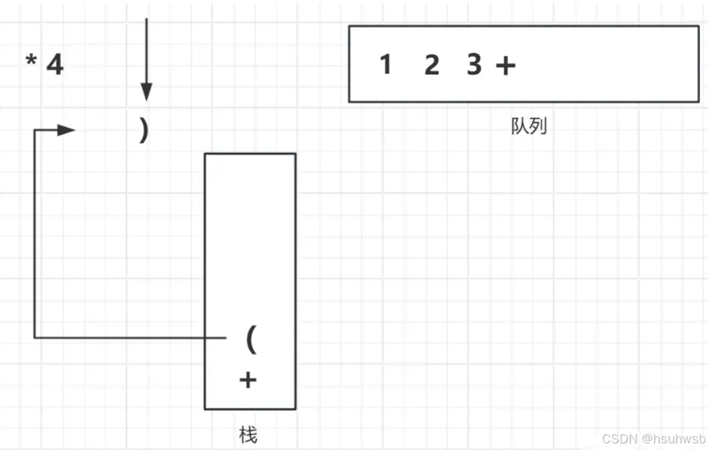
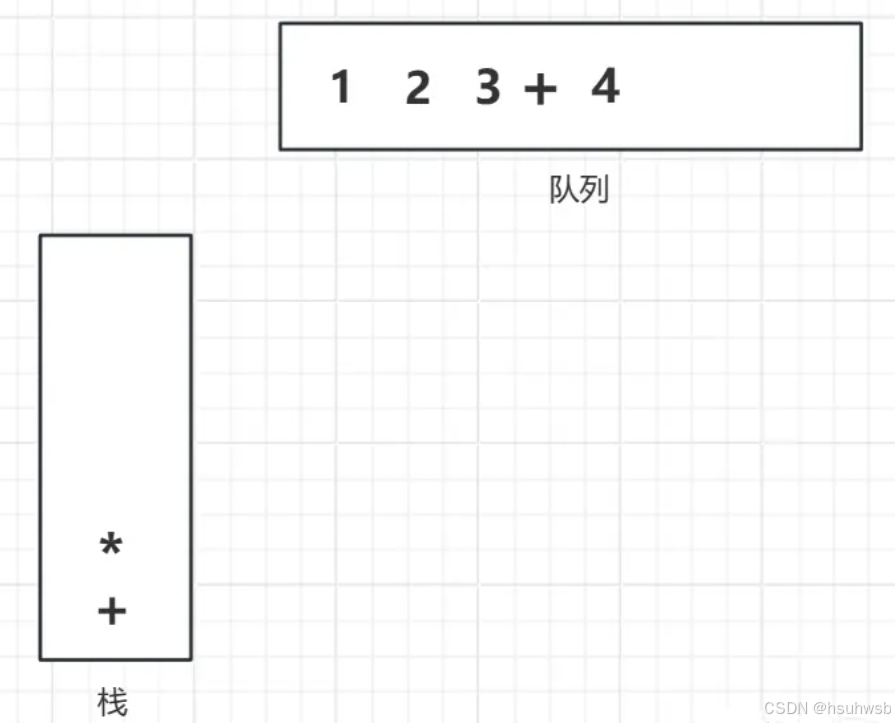
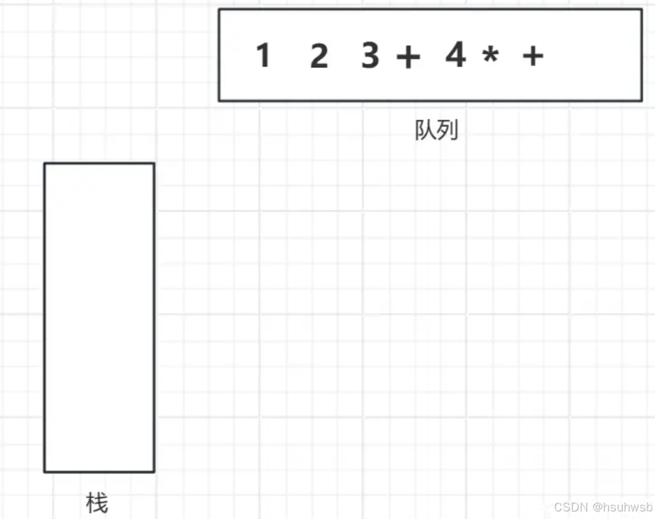
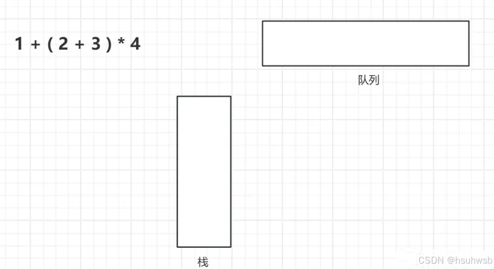

# Go 计算器 (Calculator)

一个基于命令行的计算器应用程序，使用 Go 语言实现，支持基本的数学运算和表达式计算。

## 项目概述

这个计算器应用程序使用栈和队列数据结构，实现了中缀表达式到后缀表达式的转换，并能够计算复杂的数学表达式。项目特点包括：

- 支持加减乘除基本运算
- 支持带括号的复杂表达式
- 使用栈和队列实现高效计算
- 提供用户友好的命令行界面
- 包含错误处理和异常恢复机制

## 安装要求

要运行此计算器，您需要：

- Go 编程语言环境 (推荐 Go 1.16 或更高版本)
- 命令行终端

## 安装步骤

1. 克隆此仓库到本地：

```bash
git clone https://github.com/yourusername/calculator.git
cd calculator
```

2. 编译程序：

```bash
go build calculator.go
```

3. 运行程序：

```bash
./calculator
```

Windows 用户可以运行：

```bash
calculator.exe
```

## 使用说明

1. 启动程序后，您将看到提示符要求输入表达式
2. 输入数学表达式，例如 `1+2*3` 或 `(5+3)*2`
3. 按回车键计算结果
4. 输入 `n` 并按回车键退出程序

示例：

```
请输入：1+2*3
结果为: 7
请输入：(5+3)*2
结果为: 16
请输入：n
```

## 支持的操作

- 加法：`+`
- 减法：`-`
- 乘法：`*`
- 除法：`/`
- 括号：`(` 和 `)`

## 实现原理

### 中缀表达式转后缀表达式

我们日常使用的表达式如 `1+(2+3)*4` 是中缀表达式，计算机难以直接计算。程序将其转换为后缀表达式（如 `123+4*+`）后再进行计算。

转换过程使用栈和队列实现：


转换规则：
1. 数字直接进入队列
2. 运算符与栈顶符号比较优先级：
   - 若优先级低于或等于栈顶符号，栈内元素出栈并进入队列，直到栈空或遇到左括号
   - 若优先级高于栈顶符号，直接入栈
3. 左括号直接入栈
4. 右括号导致栈内元素出栈并进入队列，直到遇到匹配的左括号
5. 最后，栈内所有剩余元素按顺序进入队列

转换示例 `1+(2+3)*4` → `123+4*+`：








### 后缀表达式计算

计算机计算后缀表达式的方法：
1. 从左到右扫描后缀表达式
2. 遇到数字，将其压入栈中
3. 遇到运算符，从栈中弹出两个数字进行运算，将结果压回栈中
4. 表达式处理完毕后，栈中唯一剩余的元素即为计算结果

## 代码结构

- `Stack` 结构体：实现栈数据结构
  - `NewStack()`: 创建新栈
  - `empty()`: 检查栈是否为空
  - `push()`: 添加元素到栈顶
  - `pop()`: 弹出栈顶元素
  - `top()`: 查看栈顶元素

- `Queue` 结构体：实现队列数据结构
  - `NewQueue()`: 创建新队列
  - `empty()`: 检查队列是否为空
  - `push()`: 添加元素到队列尾
  - `pop()`: 弹出队列头元素

- 核心函数：
  - `Transform()`: 将中缀表达式转换为后缀表达式
  - `Calculate()`: 计算后缀表达式的值
  - `isValidExpression()`: 验证输入表达式的有效性

## 错误处理

程序包含多种错误处理机制：
- 输入验证，确保只接受有效的数学表达式
- 异常恢复机制，防止程序因计算错误而崩溃
- 用户友好的错误提示

## 示例运行



## 贡献指南

欢迎对此项目做出贡献！请遵循以下步骤：

1. Fork 此仓库
2. 创建您的特性分支 (`git checkout -b feature/amazing-feature`)
3. 提交您的更改 (`git commit -m 'Add some amazing feature'`)
4. 推送到分支 (`git push origin feature/amazing-feature`)
5. 打开一个 Pull Request

## 许可证

此项目采用 MIT 许可证 - 详情请参阅 LICENSE 文件

## 联系方式

如有任何问题或建议，请通过以下方式联系我们：

- 项目链接：[https://github.com/isPrisoner/Calculator](https://github.com/isPrisoner/Calculator)
- 报告问题：[https://github.com/isPrisoner/Calculator/issues](https://github.com/isPrisoner/Calculator/issues)
