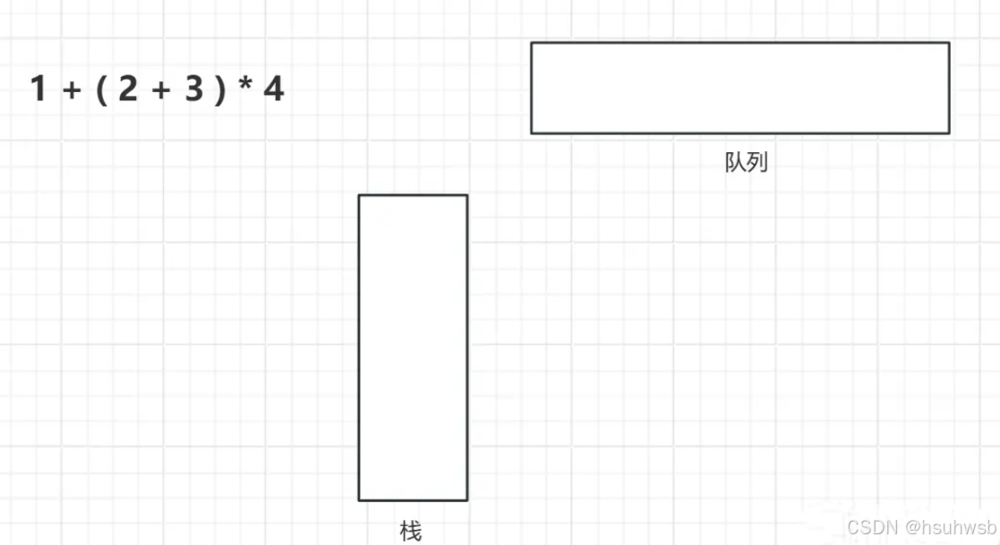
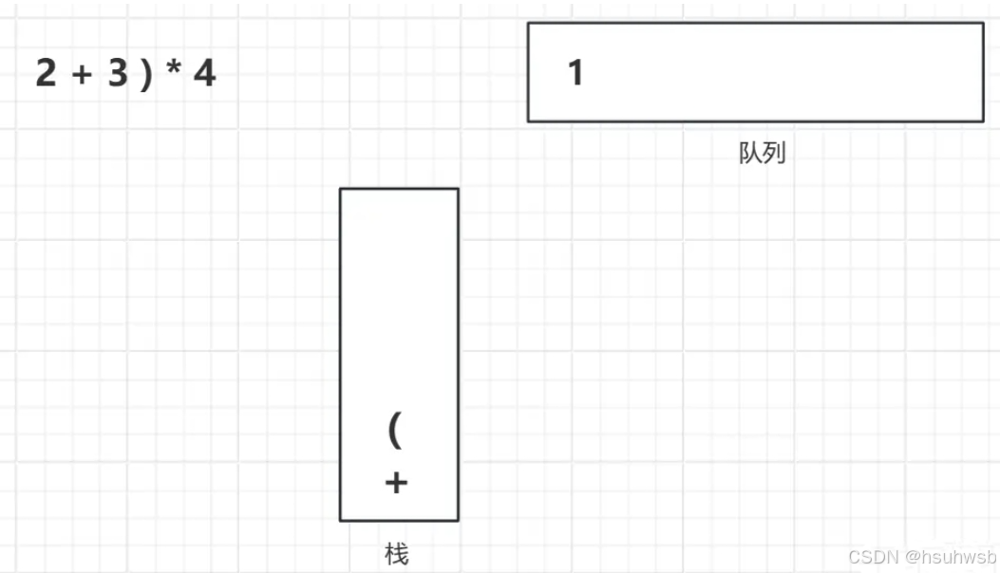
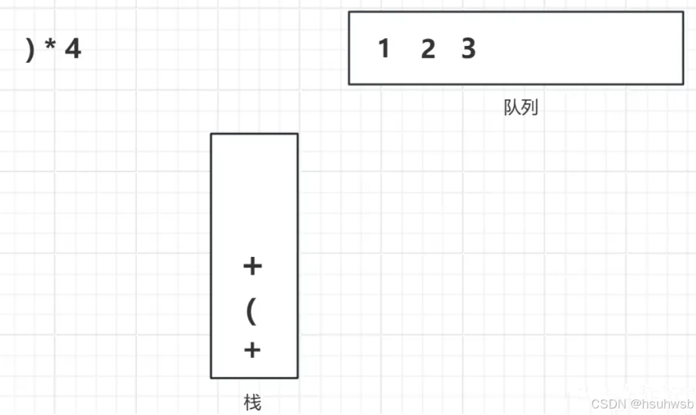
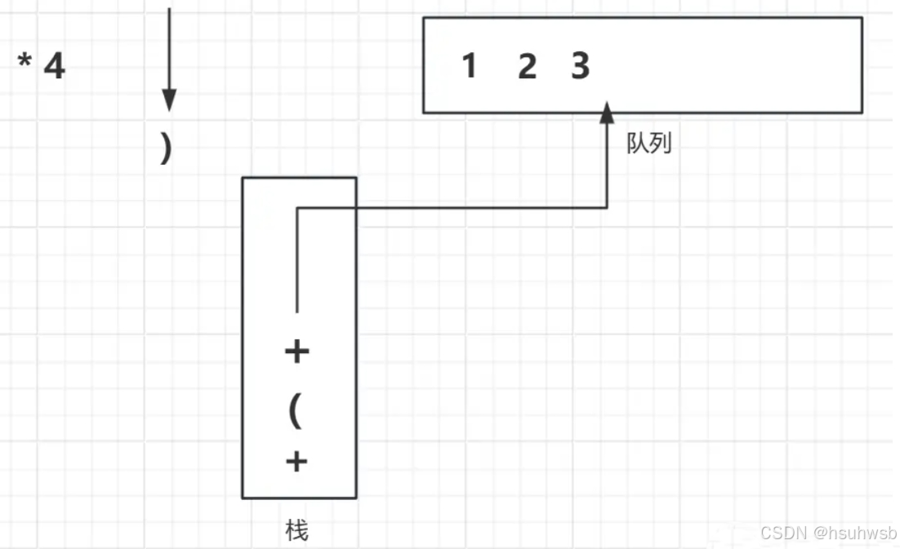
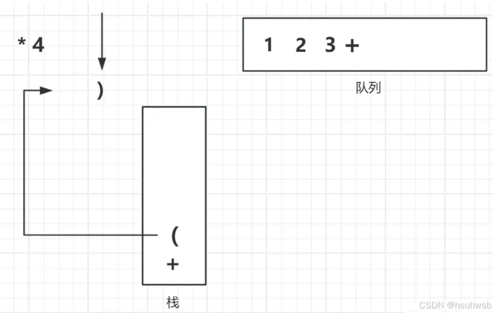
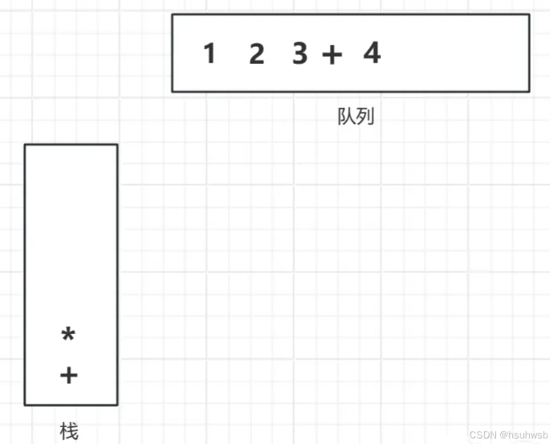

# Calculator
计算器实现原理
我们平时见到的算式都是这种类型 1+(2+3)*4，这种类型的表达式也被称为中缀表达式，我们很容易理解它的运算顺序。但是计算机却无法理解这个式子
因此我们需要将其转化为便于计算机理解的式子，转化为后缀表达式或者前缀表达式（其实都差不多）。在这里我们以后缀表达式为例子。

中缀表达式如何转化为后缀表达式

1+(2+3)*4的后缀表达式为123+4*+，前者转换成后者的过程需要利用到栈和队列这两个数据结构，不太清楚可以看看：栈和队列详解

首先我们需要一个栈和队列

然后从左到右依次根据一定规则判断是否入栈

入栈规则如下：

数字直接入队列

若是运算符，则判断其与栈顶符号的优先级，优先级低于或等于栈顶符号，栈内元素不断出栈，进入队列，直到栈空或者碰见左括号为止

若是左括号则直接入栈

若是右括号则栈内所有元素出栈，进入队列，直到遇见与之匹配的左括号

最后栈内所有元素按顺序入列

现在我们开始进行变换

最后得到我们的结果123+4*+中缀就成功转化成后缀表达式了

计算机是如何理解后缀表达式的

计算机会将之前放在队列里的元素按照先进先出(FIFO)的规则，将元素弹出进行判断

如果元素为数字，则直接入栈，若元素为运算符，则从栈中弹出两个数字进行运算，再将运算结果放入栈中

当队列全部元素取出后，最后栈中剩下的唯一一个元素就是我们要找的结果了